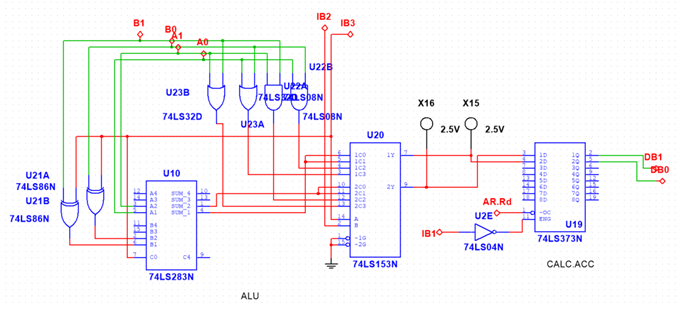
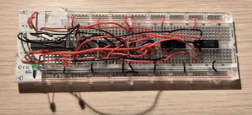
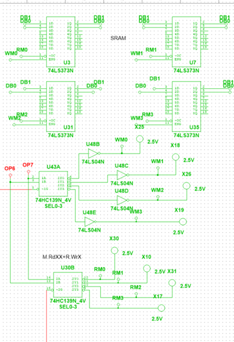
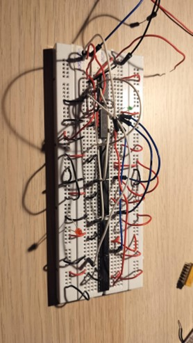
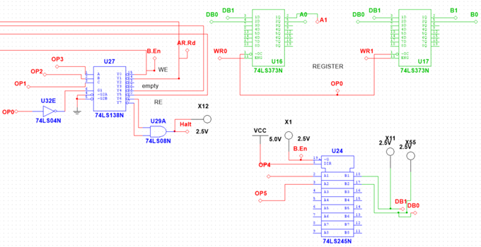
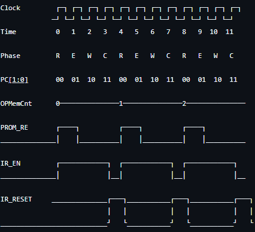
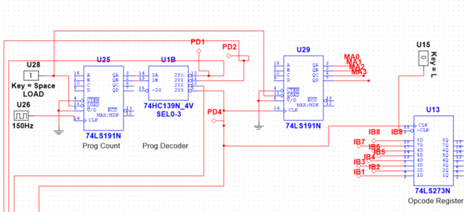

# Discrete 2-Bit Microcontroller (TTL Logic)

## Overview

This repository documents the design, simulation, and hardware implementation of a **2-bit microcontroller** built entirely from **TTL logic ICs**.  
The project was originally developed as part of a university course in a team of three.  
To explore alternative architectures and better understand debugging challenges, a full independent redesign and rebuild was also completed.

This project demonstrates:

- Modular CPU architecture
- Custom 2-bit ALU
- Discrete SRAM implementation
- Data registers implementation
- Opcode decoding and execution control
- Clock generation using NE555
- Real hardware debugging on breadboards

---

# System Architecture

The microcontroller consists of the following modules:

1. **ALU**
2. **Data SRAM**
3. **Data Registers**
4. **Opcode memory**
5. **Control unit**
6. **Program counter & timing**

Each module was designed, simulated in Multisim, and then implemented on breadboards.

---

# ALU (Arithmetic Logic Unit)

Supported operations:
- ADD
- SUB (via two’s complement)
- AND
- OR

### Components Used

- **74LS153** — Operation selector (MUX)
- **74LS283** — 4-bit full adder
- **74LS86** — XOR for two’s complement subtraction
- **74LS08** — AND gate
- **74LS32** — OR gate
- **74LS373** — Output latch

Although the datapath is 2-bit, a 4-bit adder was used for convenience and availability.

---

## ALU — Multisim Schematic

---

## ALU — Breadboard Implementation

---

# Data SRAM (2-bit)

A custom 2-bit SRAM module was built using discrete latches and decoders.

### Features

- Address lines: **A0, A1**
- Control signals: **WE**, **RE**
- Shared 2-bit data bus
- LED indicators for debugging

### Components

- **74LS373** — Memory cells
- **74LS238** — Write decoder
- **74LS139** — Read decoder
- **74LS04** — Inverters (used in simulation)

---

## SRAM — Multisim Schematic

---

## SRAM — Breadboard Implementation

---

# Opcode Handling 

Two approaches were tested:

- PROM-based opcode storage (74S188)
- Switch-based opcode generator (easier to modify during debugging)

### Opcode Format (8 bits)

| Bits | Meaning          |
|------|------------------|
| 0–3  | Instruction code |
| 4–5  | Data             |
| 6–7  | Memory address   |

### Instruction Set

| Opcode | Meaning          |
|------|------------------|
| 0000 | ADD |
| 0001 | SUB |
| 0010 | AND |
| 0011 | OR |
| 1000 | Write to memory |
| 1001 | Write ALU result to memory |
| 1100 | Load Register 0 |
| 1101 | Load Register 1 |
| 111X | HALT |

---
# Data flow

## 2-bit databus

Databus used for data transfer between buffer, SRAM and data registers.

## Two 2-bit registers (A and B) used for pull data to ALU. Registers implemented on two **74LS373** D-latches

---

## Opcode decoder & registers — Multisim Schematic

---

## Timing Diagram

---

# Clock & Program Counter

Clock generation and sequencing:

- **NE555** — Astable clock generator  
- **74LS191** — Program counter  
- **74LS273** — Instruction latch  
- **74LS139** — Microcycle decoder  

Execution cycle:

1. **Read**
2. **Execute**
3. **Write**
4. **Reset**

## Program Counter — Multisim Schematic

---

# Implementation & Debugging

Hardware assembly took several days.  
Debugging is a **main time-consuming task**, mainly due to:

- Loose wires
- Bus contention
- Incorrect connections
- PROM programming issues
- Common-collector behavior
- Difficulty tracing signals in dense wiring

### Debugging Techniques

- LED probing
- Step-by-step module isolation
- Incremental testing
- Multiple architectural redesigns (several iterations)

---

# Design Iterations

The microcontroller went through several redesigns:

- Different ALU wiring approaches
- Alternative control logic
- PROM vs SRAM opcode storage
- Bus structure changes
- Improved modularity for debugging

Each iteration increased stability and clarity.

---

# Lessons Learned

- Importance of separating datapath and control logic
- Real-world timing constraints of TTL hardware
- Practical debugging methodology
- Complexity of bus arbitration
- Why modern CPUs rely on FPGA/ASIC instead of discrete logic

---

# Possible Improvements

- Replace PROM with EEPROM or Flash
- Implement microcoded control ROM
- Expand datapath to 4 bits

---

